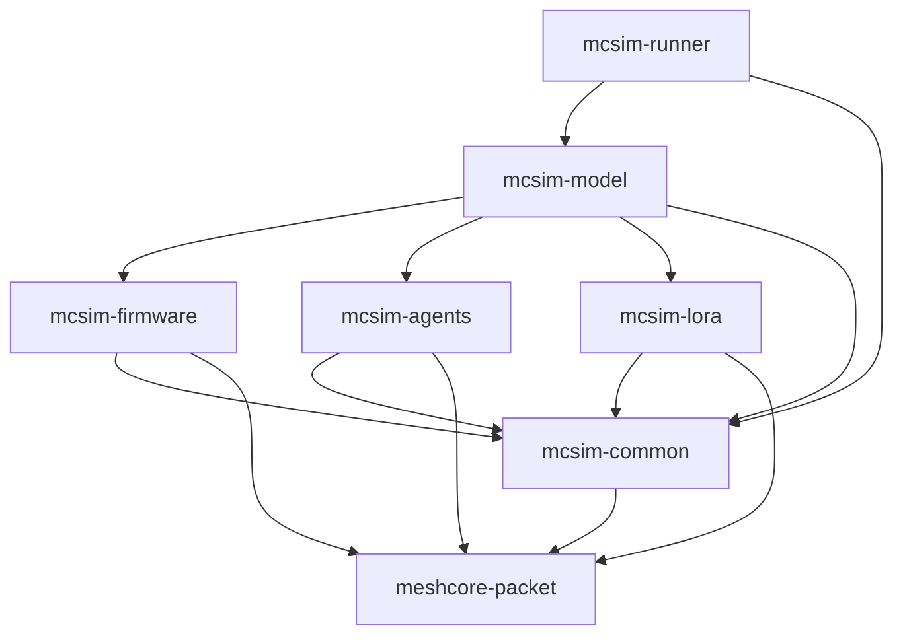
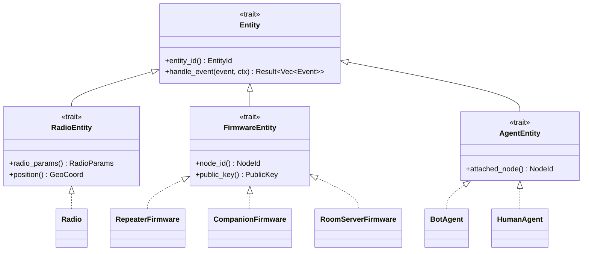
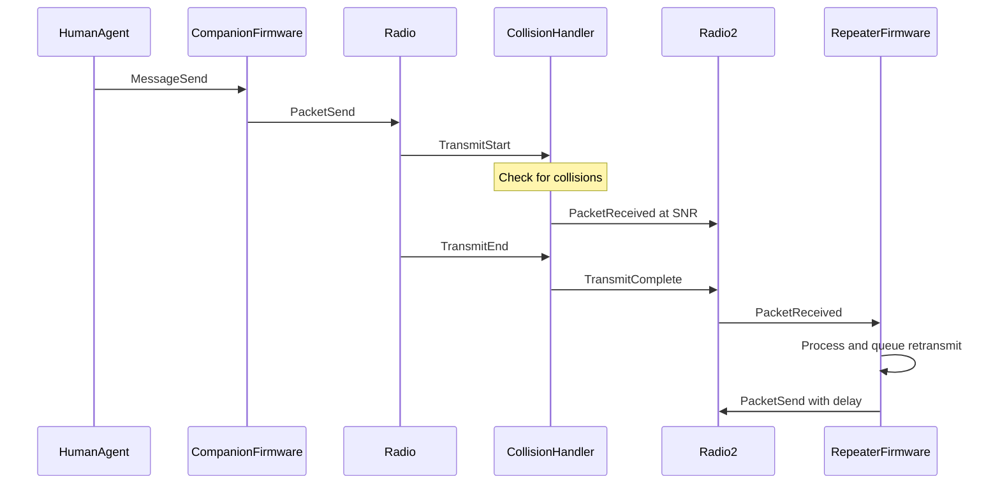
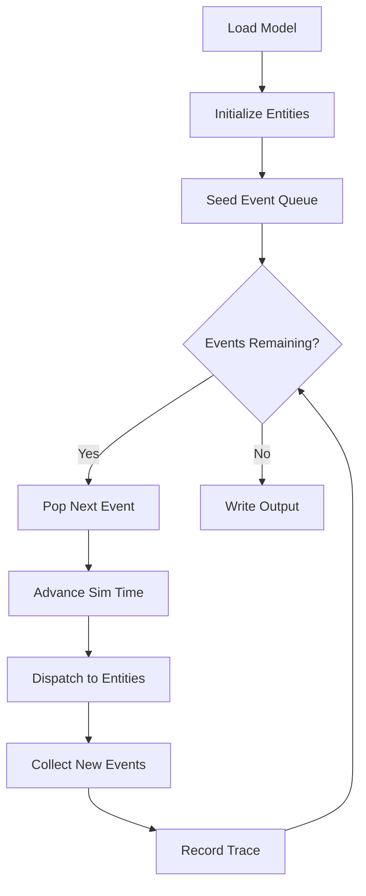

# MCSim Architecture Design

## 1. High-Level System Overview

MCSim is an event-driven simulator for MeshCore mesh networks. It models radio communications, packet routing, firmware behavior, and operator agents to analyze network performance and behavior.

### System Diagram

```
┌─────────────────────────────────────────────────────────────────────────────┐
│                              mcsim-runner                                   │
│  ┌─────────────┐  ┌─────────────┐  ┌─────────────┐  ┌─────────────────────┐ │
│  │ YAML Model  │  │ Event Loop  │  │  Simulation │  │   JSON Trace        │ │
│  │   Loader    │  │   Engine    │  │   Context   │  │   Output            │ │
│  └─────────────┘  └─────────────┘  └─────────────┘  └─────────────────────┘ │
└─────────────────────────────────────────────────────────────────────────────┘
                │                           │
                ▼                           ▼
┌─────────────────────────────────────────────────────────────────────────────┐
│                              mcsim-model                                    │
│  ┌─────────────┐  ┌─────────────┐  ┌─────────────┐  ┌─────────────────────┐ │
│  │    Node     │  │    Edge     │  │  Defaults   │  │    Override         │ │
│  │ Definitions │  │ Definitions │  │   Config    │  │    Mechanism        │ │
│  └─────────────┘  └─────────────┘  └─────────────┘  └─────────────────────┘ │
└─────────────────────────────────────────────────────────────────────────────┘
                │                           │
    ┌───────────┴───────────┬───────────────┴───────────┐
    ▼                       ▼                           ▼
┌───────────────┐   ┌───────────────┐           ┌───────────────┐
│ mcsim-agents  │   │mcsim-firmware │           │  mcsim-lora   │
│ ┌───────────┐ │   │ ┌───────────┐ │           │ ┌───────────┐ │
│ │Bot Persona│ │   │ │ Repeater  │ │           │ │   Radio   │ │
│ ├───────────┤ │   │ ├───────────┤ │           │ │  Entity   │ │
│ │Human      │ │   │ │ Companion │ │           │ ├───────────┤ │
│ │Persona    │ │   │ ├───────────┤ │           │ │Collision  │ │
│ └───────────┘ │   │ │Room Server│ │           │ │ Handler   │ │
└───────────────┘   │ └───────────┘ │           │ └───────────┘ │
        │           └───────────────┘           └───────────────┘
        │                   │                           │
        └───────────────────┼───────────────────────────┘
                            ▼
┌─────────────────────────────────────────────────────────────────────────────┐
│                              mcsim-common                                   │
│  ┌─────────────┐  ┌─────────────┐  ┌─────────────┐  ┌─────────────────────┐ │
│  │ Event Types │  │ SimContext  │  │ Timestamps  │  │   Entity Traits     │ │
│  └─────────────┘  └─────────────┘  └─────────────┘  └─────────────────────┘ │
└─────────────────────────────────────────────────────────────────────────────┘
                            │
                            ▼
┌─────────────────────────────────────────────────────────────────────────────┐
│                           meshcore-packet                                   │
│  ┌─────────────┐  ┌─────────────┐  ┌─────────────┐  ┌─────────────────────┐ │
│  │   Packet    │  │   Payload   │  │ Encryption  │  │    Codec            │ │
│  │   Types     │  │   Types     │  │   Layer     │  │    Utils            │ │
│  └─────────────┘  └─────────────┘  └─────────────┘  └─────────────────────┘ │
└─────────────────────────────────────────────────────────────────────────────┘
```

## 2. Crate Dependency Graph



### Dependency Matrix

| Crate | Dependencies |
|-------|--------------|
| meshcore-packet | none (external: serde, aes-gcm, rand) |
| mcsim-common | meshcore-packet |
| mcsim-lora | mcsim-common, meshcore-packet |
| mcsim-firmware | mcsim-common, meshcore-packet |
| mcsim-agents | mcsim-common, meshcore-packet |
| mcsim-model | mcsim-common, mcsim-lora, mcsim-firmware, mcsim-agents |
| mcsim-runner | mcsim-model, mcsim-common |

## 3. Core Traits and Relationships

### Entity Trait Hierarchy



## 4. Event Flow Diagrams

### Message Transmission Flow



### Event Loop Flow



## 5. Data Structures by Crate

### 5.1 meshcore-packet

```rust
// Core packet structure based on MeshCore spec
pub struct MeshCorePacket {
    pub header: PacketHeader,
    pub payload: PacketPayload,
    pub signature: Option<[u8; 64]>,
}

pub struct PacketHeader {
    pub packet_type: PacketType,
    pub flags: PacketFlags,
    pub path_len: u8,
    pub payload_len: u16,
    pub packet_hash: [u8; 6],
    pub sender: PublicKeyHash,
    pub destination: Destination,
    pub path: Vec<PublicKeyHash>,
}

pub enum PacketType {
    Plain = 0x00,
    Encrypted = 0x01,
    Advert = 0x02,
    ChannelMessage = 0x03,
    DirectMessage = 0x04,
    Ack = 0x05,
}

pub struct PacketFlags {
    pub is_flood: bool,
    pub want_ack: bool,
    pub is_routed: bool,
}

pub enum Destination {
    Flood,
    Direct(PublicKeyHash),
    Channel(ChannelHash),
}

pub enum PacketPayload {
    Advert(AdvertPayload),
    TextMessage(TextPayload),
    Ack(AckPayload),
    Position(PositionPayload),
    Encrypted(EncryptedPayload),
    Raw(Vec<u8>),
}

pub struct AdvertPayload {
    pub node_name: String,
    pub capabilities: NodeCapabilities,
    pub position: Option<GeoCoord>,
}

pub struct TextPayload {
    pub message: String,
    pub sender_name: Option<String>,
}

pub struct AckPayload {
    pub acked_hash: [u8; 6],
    pub hop_count: u8,
}

// Encryption support
pub struct EncryptionKey([u8; 32]);

impl MeshCorePacket {
    pub fn encode(&self) -> Vec<u8>;
    pub fn decode(data: &[u8]) -> Result<Self, PacketError>;
    pub fn encrypt(&self, key: &EncryptionKey) -> Result<Self, PacketError>;
    pub fn decrypt(&self, key: &EncryptionKey) -> Result<Self, PacketError>;
}
```

### 5.2 mcsim-common

```rust
// Time representation
#[derive(Clone, Copy, PartialEq, Eq, PartialOrd, Ord)]
pub struct SimTime(u64); // Microseconds since simulation start

impl SimTime {
    pub fn from_micros(us: u64) -> Self;
    pub fn from_millis(ms: u64) -> Self;
    pub fn from_secs(s: f64) -> Self;
    pub fn as_micros(&self) -> u64;
    pub fn as_secs_f64(&self) -> f64;
}

// Geographic coordinates
#[derive(Clone, Copy)]
pub struct GeoCoord {
    pub latitude: f64,
    pub longitude: f64,
    pub altitude_m: Option<f64>,
}

impl GeoCoord {
    pub fn distance_to(&self, other: &GeoCoord) -> f64; // meters
}

// Entity identification
#[derive(Clone, Copy, PartialEq, Eq, Hash)]
pub struct EntityId(u64);

#[derive(Clone, Copy, PartialEq, Eq, Hash)]
pub struct NodeId(pub [u8; 32]); // Public key hash

// Event system
#[derive(Clone)]
pub struct Event {
    pub id: EventId,
    pub time: SimTime,
    pub source: EntityId,
    pub targets: Vec<EntityId>,
    pub payload: EventPayload,
}

#[derive(Clone, Copy, PartialEq, Eq, Hash)]
pub struct EventId(u64);

#[derive(Clone)]
pub enum EventPayload {
    // Radio layer events
    TransmitStart(TransmitStartEvent),
    TransmitEnd(TransmitEndEvent),
    TransmitComplete(EntityId), // Radio that completed
    PacketReceived(PacketReceivedEvent),
    
    // Firmware layer events
    PacketSend(PacketSendEvent),
    
    // Agent layer events
    MessageSend(MessageSendEvent),
    MessageReceived(MessageReceivedEvent),
    MessageAcknowledged(MessageAckedEvent),
    
    // Scheduling
    Delay(DelayEvent),
    
    // Simulation control
    SimulationEnd,
}

#[derive(Clone)]
pub struct TransmitStartEvent {
    pub radio_id: EntityId,
    pub packet: LoraPacket,
    pub end_time: SimTime,
}

#[derive(Clone)]
pub struct TransmitEndEvent {
    pub radio_id: EntityId,
    pub packet: LoraPacket,
}

#[derive(Clone)]
pub struct PacketReceivedEvent {
    pub packet: LoraPacket,
    pub snr_db: f64,
    pub rssi_dbm: f64,
    pub was_collided: bool,
}

#[derive(Clone)]
pub struct PacketSendEvent {
    pub packet: MeshCorePacket,
    pub delay: Option<SimTime>,
}

#[derive(Clone)]
pub struct MessageSendEvent {
    pub destination: Destination,
    pub content: String,
    pub want_ack: bool,
}

#[derive(Clone)]
pub struct MessageReceivedEvent {
    pub packet: MeshCorePacket,
    pub from: NodeId,
}

#[derive(Clone)]
pub struct MessageAckedEvent {
    pub original_hash: [u8; 6],
    pub hop_count: u8,
}

#[derive(Clone)]
pub struct DelayEvent {
    pub entity: EntityId,
    pub callback_data: Box<dyn Any + Send>,
}

// Simulation context
pub struct SimContext {
    time: SimTime,
    rng: StdRng,
    pending_events: Vec<Event>,
    next_event_id: u64,
}

impl SimContext {
    pub fn time(&self) -> SimTime;
    pub fn rng(&mut self) -> &mut StdRng;
    pub fn post_event(&mut self, delay: SimTime, targets: Vec<EntityId>, payload: EventPayload);
    pub fn post_immediate(&mut self, targets: Vec<EntityId>, payload: EventPayload);
}

// Base entity trait
pub trait Entity: Send {
    fn entity_id(&self) -> EntityId;
    fn handle_event(&mut self, event: &Event, ctx: &mut SimContext) -> Result<(), SimError>;
}

// Entity registry for event dispatch
pub struct EntityRegistry {
    entities: HashMap<EntityId, Box<dyn Entity>>,
}

impl EntityRegistry {
    pub fn register(&mut self, entity: Box<dyn Entity>);
    pub fn get(&self, id: EntityId) -> Option<&dyn Entity>;
    pub fn get_mut(&mut self, id: EntityId) -> Option<&mut dyn Entity>;
    pub fn dispatch_event(&mut self, event: &Event, ctx: &mut SimContext) -> Result<(), SimError>;
}
```

### 5.3 mcsim-lora

```rust
// Radio parameters
#[derive(Clone)]
pub struct RadioParams {
    pub frequency_hz: u32,
    pub bandwidth_hz: u32,
    pub spreading_factor: u8,  // 7-12
    pub coding_rate: u8,       // 5-8 (4/5 to 4/8)
    pub tx_power_dbm: i8,
}

impl RadioParams {
    pub fn time_on_air(&self, payload_len: usize) -> SimTime;
    pub fn default_meshcore() -> Self; // Standard MeshCore params
}

// LoRa packet wrapper
#[derive(Clone)]
pub struct LoraPacket {
    pub id: u64,
    pub payload: Vec<u8>,  // Raw bytes including MeshCore packet
    pub params: RadioParams,
    pub tx_power_dbm: i8,
}

// Reception probability calculation
pub fn reception_probability(snr_db: f64, spreading_factor: u8) -> f64;

// Collision detection
pub struct CollisionContext {
    pub start_time: SimTime,
    pub end_time: SimTime,
    pub frequency_hz: u32,
    pub packet_id: u64,
}

pub fn check_collision(
    incoming: &CollisionContext,
    existing: &[CollisionContext],
) -> CollisionResult;

pub enum CollisionResult {
    NoCollision,
    Destroyed,              // Incoming packet destroyed
    BothDestroyed(u64),     // Both packets destroyed, returns other packet id
    CaptureEffect(u64),     // Incoming survives, other destroyed
}

// Radio entity
pub struct Radio {
    id: EntityId,
    params: RadioParams,
    position: GeoCoord,
    attached_firmware: EntityId,
    
    // State
    is_transmitting: bool,
    current_tx: Option<LoraPacket>,
    active_receptions: Vec<ActiveReception>,
}

struct ActiveReception {
    packet: LoraPacket,
    start_time: SimTime,
    end_time: SimTime,
    snr_db: f64,
    rssi_dbm: f64,
    collided: bool,
}

impl Entity for Radio {
    fn entity_id(&self) -> EntityId;
    fn handle_event(&mut self, event: &Event, ctx: &mut SimContext) -> Result<(), SimError>;
}

pub trait RadioEntity: Entity {
    fn radio_params(&self) -> &RadioParams;
    fn position(&self) -> GeoCoord;
}

// Link model (simplified)
pub struct LinkModel {
    edges: HashMap<(EntityId, EntityId), LinkParams>,
}

pub struct LinkParams {
    pub snr_db: f64,
    pub rssi_dbm: f64,
}

impl LinkModel {
    pub fn get_link(&self, from: EntityId, to: EntityId) -> Option<&LinkParams>;
    pub fn add_edge(&mut self, from: EntityId, to: EntityId, params: LinkParams);
}
```

### 5.4 mcsim-firmware

```rust
// Common firmware configuration
#[derive(Clone)]
pub struct FirmwareConfig {
    pub node_id: NodeId,
    pub public_key: [u8; 32],
    pub private_key: [u8; 32],
    pub advert_interval: SimTime,
    pub encryption_key: Option<EncryptionKey>,
}

// Repeater firmware
#[derive(Clone)]
pub struct RepeaterConfig {
    pub base: FirmwareConfig,
    pub tx_delay_min: SimTime,
    pub tx_delay_max: SimTime,
    pub max_retransmits: u8,
}

pub struct RepeaterFirmware {
    id: EntityId,
    config: RepeaterConfig,
    attached_radio: EntityId,
    
    // State
    seen_packets: LruCache<[u8; 6], u8>,  // packet_hash -> retransmit count
    next_advert: SimTime,
    tx_queue: VecDeque<QueuedTx>,
}

impl Entity for RepeaterFirmware { /* ... */ }

pub trait FirmwareEntity: Entity {
    fn node_id(&self) -> NodeId;
    fn public_key(&self) -> &[u8; 32];
    fn attached_radio(&self) -> EntityId;
}

// Companion firmware (client device)
#[derive(Clone)]
pub struct CompanionConfig {
    pub base: FirmwareConfig,
    pub tx_delay_min: SimTime,
    pub tx_delay_max: SimTime,
    pub ack_timeout: SimTime,
    pub max_retries: u8,
}

pub struct CompanionFirmware {
    id: EntityId,
    config: CompanionConfig,
    attached_radio: EntityId,
    attached_agent: Option<EntityId>,
    
    // State
    seen_packets: LruCache<[u8; 6], SeenPacketInfo>,
    pending_acks: HashMap<[u8; 6], PendingAck>,
    tx_queue: VecDeque<QueuedTx>,
    next_advert: SimTime,
}

struct PendingAck {
    original_packet: MeshCorePacket,
    retry_count: u8,
    next_retry: SimTime,
}

impl Entity for CompanionFirmware { /* ... */ }

// Room server placeholder
pub struct RoomServerConfig {
    pub base: FirmwareConfig,
    pub room_id: [u8; 16],
}

pub struct RoomServerFirmware {
    id: EntityId,
    config: RoomServerConfig,
    attached_radio: EntityId,
    // Placeholder - minimal implementation
}

impl Entity for RoomServerFirmware { /* ... */ }
```

### 5.5 mcsim-agents

```rust
// Session parameters
#[derive(Clone)]
pub struct SessionParams {
    pub message_interval_min: SimTime,
    pub message_interval_max: SimTime,
    pub messages_per_session: u32,
    pub session_gap_min: SimTime,
    pub session_gap_max: SimTime,
}

// Bot agent (responds to messages)
#[derive(Clone)]
pub struct BotConfig {
    pub name: String,
    pub response_delay_min: SimTime,
    pub response_delay_max: SimTime,
    pub channels: Vec<ChannelHash>,
    pub response_probability: f64,
}

pub struct BotAgent {
    id: EntityId,
    config: BotConfig,
    attached_node: NodeId,
    attached_firmware: EntityId,
    
    // State
    pending_responses: VecDeque<PendingResponse>,
}

impl Entity for BotAgent { /* ... */ }

pub trait AgentEntity: Entity {
    fn attached_node(&self) -> NodeId;
    fn attached_firmware(&self) -> EntityId;
}

// Human agent (initiates messages)
#[derive(Clone)]
pub struct HumanConfig {
    pub name: String,
    pub session_params: SessionParams,
    pub dm_targets: Vec<NodeId>,      // Nodes to send DMs to
    pub channels: Vec<ChannelHash>,   // Channels to post to
    pub dm_probability: f64,          // Probability of DM vs channel message
}

pub struct HumanAgent {
    id: EntityId,
    config: HumanConfig,
    attached_node: NodeId,
    attached_firmware: EntityId,
    
    // State
    messages_sent: u32,
    current_session_messages: u32,
    next_message_time: SimTime,
    in_session: bool,
}

impl Entity for HumanAgent { /* ... */ }

// Message content generation
pub struct MessageGenerator {
    rng: StdRng,
    word_list: Vec<String>,
}

impl MessageGenerator {
    pub fn new(seed: u64) -> Self;
    pub fn generate_message(&mut self, min_words: usize, max_words: usize) -> String;
}
```

### 5.6 mcsim-model

```rust
// YAML model structure
#[derive(Deserialize)]
pub struct SimulationModel {
    pub defaults: Option<DefaultsConfig>,
    pub nodes: Vec<NodeConfig>,
    pub edges: Vec<EdgeConfig>,
}

#[derive(Deserialize)]
pub struct DefaultsConfig {
    pub radio: Option<RadioParamsConfig>,
    pub repeater: Option<RepeaterParamsConfig>,
    pub companion: Option<CompanionParamsConfig>,
    pub human_agent: Option<HumanAgentParamsConfig>,
    pub bot_agent: Option<BotAgentParamsConfig>,
}

#[derive(Deserialize)]
pub struct NodeConfig {
    pub name: String,
    pub location: GeoCoordConfig,
    pub firmware: FirmwareConfig,
    pub agent: Option<AgentConfig>,
    
    // Optional overrides
    pub radio_override: Option<RadioParamsConfig>,
}

#[derive(Deserialize)]
pub struct GeoCoordConfig {
    pub lat: f64,
    pub lon: f64,
    pub alt: Option<f64>,
}

#[derive(Deserialize)]
#[serde(tag = "type")]
pub enum FirmwareConfigYaml {
    Repeater(RepeaterParamsConfig),
    Companion(CompanionParamsConfig),
    RoomServer(RoomServerParamsConfig),
}

#[derive(Deserialize)]
#[serde(tag = "type")]
pub enum AgentConfigYaml {
    Human(HumanAgentParamsConfig),
    Bot(BotAgentParamsConfig),
}

#[derive(Deserialize)]
pub struct EdgeConfig {
    pub from: String,  // Node name
    pub to: String,    // Node name
    pub snr_db: f64,
    pub rssi_dbm: Option<f64>,
}

// Model loading
pub struct ModelLoader;

impl ModelLoader {
    pub fn load_from_file(path: &Path) -> Result<SimulationModel, ModelError>;
    pub fn load_from_str(yaml: &str) -> Result<SimulationModel, ModelError>;
    
    pub fn build_simulation(
        model: &SimulationModel,
        seed: u64,
    ) -> Result<BuiltSimulation, ModelError>;
}

pub struct BuiltSimulation {
    pub entities: EntityRegistry,
    pub link_model: LinkModel,
    pub initial_events: Vec<Event>,
}
```

### 5.7 mcsim-runner

```rust
// CLI configuration
#[derive(Parser)]
pub struct RunnerConfig {
    /// Path to YAML model file
    #[arg(short, long)]
    pub model: PathBuf,
    
    /// Simulation duration in seconds
    #[arg(short, long, default_value = "3600")]
    pub duration: f64,
    
    /// Random seed
    #[arg(short, long)]
    pub seed: Option<u64>,
    
    /// Output trace file path
    #[arg(short, long)]
    pub output: Option<PathBuf>,
    
    /// Verbose output
    #[arg(short, long)]
    pub verbose: bool,
}

// Event loop
pub struct EventLoop {
    event_queue: BinaryHeap<Reverse<Event>>,
    entities: EntityRegistry,
    link_model: LinkModel,
    context: SimContext,
    trace: TraceRecorder,
}

impl EventLoop {
    pub fn new(
        built: BuiltSimulation,
        seed: u64,
        trace_output: Option<Box<dyn Write>>,
    ) -> Self;
    
    pub fn run(&mut self, duration: SimTime) -> Result<SimulationStats, SimError>;
    
    fn step(&mut self) -> Result<bool, SimError>;
}

pub struct SimulationStats {
    pub total_events: u64,
    pub packets_transmitted: u64,
    pub packets_received: u64,
    pub packets_collided: u64,
    pub messages_sent: u64,
    pub messages_acked: u64,
    pub simulation_time: SimTime,
    pub wall_time: Duration,
}

// Trace output (structured by event type)
pub struct TraceRecorder {
    output: Option<Box<dyn Write>>,
    entries: Vec<TraceEntry>,
}

/// Trace entry with event-specific payload
#[derive(Serialize)]
pub struct TraceEntry {
    pub origin: String,      // Node name (e.g., "Alice")
    pub origin_id: String,   // Entity ID
    pub timestamp: String,   // ISO 8601
    #[serde(flatten)]
    pub payload: TracePayload,
}

/// Event-specific payloads (only includes relevant fields)
#[derive(Serialize)]
#[serde(tag = "type")]
pub enum TracePayload {
    #[serde(rename = "PACKET")]
    TxPacket { direction: String, rssi: String, payload_hash: String, packet_hex: String, ... },
    #[serde(rename = "PACKET")]
    RxPacket { direction: String, snr: String, rssi: String, payload_hash: String, reception_status: String, ... },
    #[serde(rename = "TIMER")]
    Timer { timer_id: u64 },
    #[serde(rename = "MESSAGE")]
    MessageSend { direction: String, destination: String },
    #[serde(rename = "MESSAGE")]
    MessageReceived { direction: String },
}

impl TraceRecorder {
    pub fn record(&mut self, entry: TraceEntry);
    pub fn flush(&mut self) -> Result<(), RunnerError>;
}
```

## 6. Public API Design

### 6.1 meshcore-packet API

```rust
// Encoding/Decoding
pub fn encode_packet(packet: &MeshCorePacket) -> Vec<u8>;
pub fn decode_packet(data: &[u8]) -> Result<MeshCorePacket, PacketError>;

// Encryption
pub fn encrypt_packet(
    packet: &MeshCorePacket,
    key: &EncryptionKey,
) -> Result<MeshCorePacket, PacketError>;

pub fn decrypt_packet(
    packet: &MeshCorePacket,
    key: &EncryptionKey,
) -> Result<MeshCorePacket, PacketError>;

// Builders
pub struct PacketBuilder;
impl PacketBuilder {
    pub fn advert(node_name: &str, capabilities: NodeCapabilities) -> MeshCorePacket;
    pub fn direct_message(to: &NodeId, content: &str) -> MeshCorePacket;
    pub fn channel_message(channel: &ChannelHash, content: &str) -> MeshCorePacket;
    pub fn ack(acked_hash: [u8; 6], hop_count: u8) -> MeshCorePacket;
}

// Hash calculation
pub fn calculate_packet_hash(packet: &MeshCorePacket) -> [u8; 6];
```

### 6.2 mcsim-common API

```rust
// Time operations
pub fn sim_time_now() -> SimTime;  // Only valid within event handler

// Entity management
pub trait Entity {
    fn entity_id(&self) -> EntityId;
    fn handle_event(&mut self, event: &Event, ctx: &mut SimContext) -> Result<(), SimError>;
}

// Context operations
impl SimContext {
    pub fn time(&self) -> SimTime;
    pub fn rng(&mut self) -> &mut impl Rng;
    pub fn post_event(&mut self, delay: SimTime, targets: Vec<EntityId>, payload: EventPayload);
    pub fn post_immediate(&mut self, targets: Vec<EntityId>, payload: EventPayload);
}
```

### 6.3 mcsim-lora API

```rust
// Radio creation
pub fn create_radio(
    id: EntityId,
    params: RadioParams,
    position: GeoCoord,
    attached_firmware: EntityId,
) -> Radio;

// Link model
pub fn create_link_model() -> LinkModel;
impl LinkModel {
    pub fn add_link(&mut self, from: EntityId, to: EntityId, snr_db: f64, rssi_dbm: f64);
    pub fn get_link(&self, from: EntityId, to: EntityId) -> Option<&LinkParams>;
}

// PHY calculations
pub fn calculate_snr_sensitivity(spreading_factor: u8) -> f64;
pub fn calculate_time_on_air(params: &RadioParams, payload_len: usize) -> SimTime;
pub fn reception_probability(snr_db: f64, spreading_factor: u8) -> f64;
```

### 6.4 mcsim-firmware API

```rust
// Firmware creation
pub fn create_repeater(
    id: EntityId,
    config: RepeaterConfig,
    attached_radio: EntityId,
) -> RepeaterFirmware;

pub fn create_companion(
    id: EntityId,
    config: CompanionConfig,
    attached_radio: EntityId,
) -> CompanionFirmware;

pub fn create_room_server(
    id: EntityId,
    config: RoomServerConfig,
    attached_radio: EntityId,
) -> RoomServerFirmware;
```

### 6.5 mcsim-agents API

```rust
// Agent creation
pub fn create_human_agent(
    id: EntityId,
    config: HumanConfig,
    attached_node: NodeId,
    attached_firmware: EntityId,
) -> HumanAgent;

pub fn create_bot_agent(
    id: EntityId,
    config: BotConfig,
    attached_node: NodeId,
    attached_firmware: EntityId,
) -> BotAgent;

// Message generation
pub fn create_message_generator(seed: u64) -> MessageGenerator;
impl MessageGenerator {
    pub fn generate(&mut self, min_words: usize, max_words: usize) -> String;
}
```

### 6.6 mcsim-model API

```rust
// Model loading
pub fn load_model(path: &Path) -> Result<SimulationModel, ModelError>;
pub fn parse_model(yaml: &str) -> Result<SimulationModel, ModelError>;

// Model building
pub fn build_simulation(
    model: &SimulationModel,
    seed: u64,
) -> Result<BuiltSimulation, ModelError>;
```

### 6.7 mcsim-runner API

```rust
// Main entry point
pub fn run_simulation(config: RunnerConfig) -> Result<SimulationStats, SimError>;

// Programmatic API
pub fn create_event_loop(
    built: BuiltSimulation,
    seed: u64,
) -> EventLoop;

impl EventLoop {
    pub fn run(&mut self, duration: SimTime) -> Result<SimulationStats, SimError>;
    pub fn step(&mut self) -> Result<bool, SimError>;  // Single step, returns false when done
}
```

## 7. Error Handling Strategy

### Error Types Hierarchy

```rust
// Root error type
#[derive(Debug, thiserror::Error)]
pub enum McsimError {
    #[error("Packet error: {0}")]
    Packet(#[from] PacketError),
    
    #[error("Simulation error: {0}")]
    Simulation(#[from] SimError),
    
    #[error("Model error: {0}")]
    Model(#[from] ModelError),
    
    #[error("IO error: {0}")]
    Io(#[from] std::io::Error),
}

// Packet-level errors
#[derive(Debug, thiserror::Error)]
pub enum PacketError {
    #[error("Invalid packet format: {0}")]
    InvalidFormat(String),
    
    #[error("Decode error at offset {offset}: {message}")]
    DecodeError { offset: usize, message: String },
    
    #[error("Encryption error: {0}")]
    EncryptionError(String),
    
    #[error("Invalid signature")]
    InvalidSignature,
    
    #[error("Packet too large: {size} bytes (max {max})")]
    TooLarge { size: usize, max: usize },
}

// Simulation errors
#[derive(Debug, thiserror::Error)]
pub enum SimError {
    #[error("Entity not found: {0:?}")]
    EntityNotFound(EntityId),
    
    #[error("Invalid event target: {0:?}")]
    InvalidTarget(EntityId),
    
    #[error("Simulation time overflow")]
    TimeOverflow,
    
    #[error("Event handler error in entity {entity:?}: {message}")]
    HandlerError { entity: EntityId, message: String },
}

// Model errors
#[derive(Debug, thiserror::Error)]
pub enum ModelError {
    #[error("YAML parse error: {0}")]
    YamlError(#[from] serde_yaml::Error),
    
    #[error("Node not found: {0}")]
    NodeNotFound(String),
    
    #[error("Invalid configuration: {0}")]
    InvalidConfig(String),
    
    #[error("Duplicate node name: {0}")]
    DuplicateNode(String),
    
    #[error("Invalid edge: {from} -> {to}")]
    InvalidEdge { from: String, to: String },
}
```

### Error Handling Guidelines

1. **Use `Result` everywhere** - All fallible operations return `Result<T, E>`
2. **Propagate with `?`** - Use the `?` operator for error propagation
3. **Context with `anyhow` or custom messages** - Add context when propagating errors
4. **Log errors at boundaries** - Log errors at crate boundaries before propagating
5. **Graceful degradation** - Where possible, log and continue rather than fail

## 8. Testing Strategy

### Unit Testing

Each crate should have comprehensive unit tests:

```rust
// meshcore-packet tests
#[cfg(test)]
mod tests {
    #[test]
    fn test_encode_decode_roundtrip() { /* ... */ }
    
    #[test]
    fn test_encrypt_decrypt_roundtrip() { /* ... */ }
    
    #[test]
    fn test_packet_hash_calculation() { /* ... */ }
    
    #[test]
    fn test_decode_real_packet() {
        // Test against known MeshCore packets
    }
}

// mcsim-lora tests
#[cfg(test)]
mod tests {
    #[test]
    fn test_time_on_air_calculation() { /* ... */ }
    
    #[test]
    fn test_collision_detection() { /* ... */ }
    
    #[test]
    fn test_reception_probability() { /* ... */ }
}
```

### Integration Testing

```rust
// tests/integration_tests.rs
#[test]
fn test_simple_two_node_scenario() {
    // Load a simple model with two nodes
    // Run simulation
    // Verify packets are exchanged
}

#[test]
fn test_repeater_chain() {
    // Test message propagation through repeater chain
}

#[test]
fn test_collision_handling() {
    // Test that collisions are properly detected
}
```

### Property-Based Testing

Use `proptest` for property-based testing:

```rust
proptest! {
    #[test]
    fn packet_roundtrip(data: Vec<u8>) {
        // Any valid packet should encode/decode correctly
    }
    
    #[test]
    fn time_monotonicity(events: Vec<Event>) {
        // Events should always be processed in time order
    }
}
```

### Determinism Testing

```rust
#[test]
fn test_deterministic_simulation() {
    let seed = 12345u64;
    
    let result1 = run_simulation_with_seed(seed);
    let result2 = run_simulation_with_seed(seed);
    
    assert_eq!(result1.trace, result2.trace);
}
```

### Reference Implementation Testing

Compare against known-good implementations:

```rust
#[test]
fn test_against_javascript_decoder() {
    // Test packet decoding against meshcore-decoder output
}

#[test]
fn test_against_meshtasticator_phy() {
    // Test PHY calculations against Meshtasticator
}
```

## 9. Example YAML Model

```yaml
defaults:
  radio:
    frequency_hz: 906000000
    bandwidth_hz: 250000
    spreading_factor: 11
    coding_rate: 5
    tx_power_dbm: 20
  
  repeater:
    tx_delay_min_ms: 100
    tx_delay_max_ms: 500
    max_retransmits: 3
    advert_interval_s: 900
  
  companion:
    tx_delay_min_ms: 100
    tx_delay_max_ms: 500
    ack_timeout_s: 30
    max_retries: 3
    advert_interval_s: 900
  
  human_agent:
    message_interval_min_s: 60
    message_interval_max_s: 300
    messages_per_session: 5
    session_gap_min_s: 1800
    session_gap_max_s: 7200

nodes:
  - name: "HOWL Repeater"
    location:
      lat: 37.7749
      lon: -122.4194
      alt: 100
    firmware:
      type: Repeater
  
  - name: "Alice Phone"
    location:
      lat: 37.7850
      lon: -122.4094
    firmware:
      type: Companion
    agent:
      type: Human
      dm_targets: ["Bob Phone"]
      dm_probability: 0.8
  
  - name: "Bob Phone"
    location:
      lat: 37.7650
      lon: -122.4294
    firmware:
      type: Companion
    agent:
      type: Human
      dm_targets: ["Alice Phone"]
      dm_probability: 0.5

edges:
  # HOWL can hear both phones
  - from: "Alice Phone"
    to: "HOWL Repeater"
    snr_db: 10.0
    rssi_dbm: -85
  - from: "HOWL Repeater"
    to: "Alice Phone"
    snr_db: 12.0
    rssi_dbm: -80
  
  - from: "Bob Phone"
    to: "HOWL Repeater"
    snr_db: 8.0
    rssi_dbm: -90
  - from: "HOWL Repeater"
    to: "Bob Phone"
    snr_db: 9.0
    rssi_dbm: -88
  
  # Direct link between phones (weak)
  - from: "Alice Phone"
    to: "Bob Phone"
    snr_db: -2.0
    rssi_dbm: -110
  - from: "Bob Phone"
    to: "Alice Phone"
    snr_db: -3.0
    rssi_dbm: -112
```

## 10. Workspace Structure

```
mcsim/
├── Cargo.toml              # Workspace root
├── ARCHITECTURE.md         # This document
├── README.md
├── plans/                  # Planning documents
│
├── crates/
│   ├── meshcore-packet/
│   │   ├── Cargo.toml
│   │   └── src/
│   │       ├── lib.rs
│   │       ├── packet.rs
│   │       ├── payload.rs
│   │       ├── codec.rs
│   │       ├── encryption.rs
│   │       └── error.rs
│   │
│   ├── mcsim-common/
│   │   ├── Cargo.toml
│   │   └── src/
│   │       ├── lib.rs
│   │       ├── time.rs
│   │       ├── geo.rs
│   │       ├── entity.rs
│   │       ├── event.rs
│   │       ├── context.rs
│   │       └── error.rs
│   │
│   ├── mcsim-lora/
│   │   ├── Cargo.toml
│   │   └── src/
│   │       ├── lib.rs
│   │       ├── params.rs
│   │       ├── packet.rs
│   │       ├── radio.rs
│   │       ├── collision.rs
│   │       ├── link.rs
│   │       └── phy.rs
│   │
│   ├── mcsim-firmware/
│   │   ├── Cargo.toml
│   │   └── src/
│   │       ├── lib.rs
│   │       ├── config.rs
│   │       ├── repeater.rs
│   │       ├── companion.rs
│   │       └── room_server.rs
│   │
│   ├── mcsim-agents/
│   │   ├── Cargo.toml
│   │   └── src/
│   │       ├── lib.rs
│   │       ├── session.rs
│   │       ├── human.rs
│   │       ├── bot.rs
│   │       └── message_gen.rs
│   │
│   ├── mcsim-model/
│   │   ├── Cargo.toml
│   │   └── src/
│   │       ├── lib.rs
│   │       ├── schema.rs
│   │       ├── loader.rs
│   │       ├── builder.rs
│   │       └── validation.rs
│   │
│   └── mcsim-runner/
│       ├── Cargo.toml
│       └── src/
│           ├── main.rs
│           ├── cli.rs
│           ├── event_loop.rs
│           ├── trace.rs
│           └── stats.rs
│
├── examples/
│   ├── simple_network.yaml
│   └── large_network.yaml
│
└── tests/
    └── integration/
        ├── two_node_test.rs
        └── repeater_chain_test.rs
```

## 11. Implementation Order

1. **meshcore-packet** - Foundation, no internal dependencies
2. **mcsim-common** - Core types needed by all other crates
3. **mcsim-lora** - Radio simulation layer
4. **mcsim-firmware** - Node firmware simulation
5. **mcsim-agents** - Operator agents
6. **mcsim-model** - YAML model loading
7. **mcsim-runner** - Main binary and event loop

## 12. Future Considerations

### Extensibility Points

- **Custom agents**: Trait-based agent system allows adding new agent types
- **Custom firmware**: Firmware trait allows new firmware implementations
- **Link models**: Pluggable link models (static, distance-based, time-varying)
- **Output formats**: Trace recorder can be extended for new formats

### Performance Considerations

- **Event queue**: Use a binary heap for O(log n) event insertion/extraction
- **Entity lookup**: Use HashMap for O(1) entity lookup
- **Packet cache**: LRU cache for seen packets to bound memory
- **Parallel processing**: Consider rayon for parallel event dispatch (if no dependencies)

### Known Limitations

- **No real-time simulation**: Runs as fast as possible
- **Simplified PHY model**: Based on SNR threshold, not full OFDM simulation
- **No terrain modeling**: Link quality is specified directly, not calculated
- **No mobility**: Node positions are static during simulation
